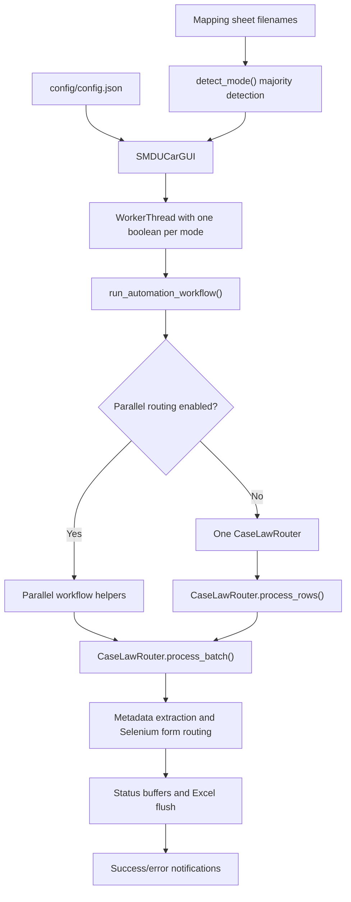

# Router Modes: Current Architecture

Status: architecture snapshot only  
Scope: `SADM Autorouter Sandbox`  
Production rule: the sibling `SADM Autorouter` project is the stable backup and must not be edited.

Documentation entry point: [README.md](README.md)  
Current closeout: [MODULARIZATION_CLOSEOUT.md](MODULARIZATION_CLOSEOUT.md)

This document records the current mode architecture before any behavior-preserving
modularization. It is descriptive, not a claim that the current boundaries are ideal.

Phase 1 now provides a data-only registry in `core/router_modes/`. The GUI mode-option
list reads from that registry; runtime flags, workflow orchestration, and Selenium
routing remain unchanged.

Phase 2 adds canonical-to-legacy flag conversion and a thin compatibility wrapper.
The GUI uses the shared conversion when constructing its worker, and worker crash
reporting uses the shared legacy precedence. The existing workflow signature and all
Selenium/router methods remain unchanged.

Phase 3 adds a non-browser `ModeRunPlan` and scope-selection policy. The workflow uses
these helpers for mode identity, exact court-specific row filtering, initial status,
and parallel labels/batch type. The existing extractor predicates are injected into
the policy, and `CaseLawRouter` remains unchanged.

Phase 4 adds specialized document-mode handlers that delegate to the existing router
methods. Row and form dispatch now select a handler with the characterized legacy
precedence; metadata fallback, statuses, browser operations, selectors, waits,
retries, form filling, and route selection remain in `CaseLawRouter`.

Six Phase 5 slices move the OHTAX0, MNSUTB, MSPB, IRSPLR, and ITC IRT form-routing
flows plus the shared SMD/DAR fallback to corresponding
`core/router_modes/*_selenium.py` modules. The specialized `CaseLawRouter` methods
remain compatibility wrappers; `fill_irt_form()` retains row preconditions,
specialized dispatch, and its error boundary before delegating the shared fallback.
Common docket/date/page/court preparation additionally delegates through
`CaseLawRouter.prepare_common_fields()` to
`core/router_modes/common_fields_selenium.py`. Final route, Ready, Save, and
invalid-combination retry behavior delegates through
`CaseLawRouter.handle_routing_and_save()` to
`core/router_modes/routing_save_selenium.py`. Mode-specific and SMD/DAR field-fill
helpers remain in the router except counsel comments/main-LNI linkage, which
delegates through `CaseLawRouter.handle_counsel_fields()` to
`core/router_modes/counsel_fields_selenium.py`. Main-opinion case/source/Related/
comments composition delegates through `CaseLawRouter.handle_main_opinion_fields()`
to `core/router_modes/main_opinion_fields_selenium.py`, while related-LNI and
attachment orchestration delegates through `CaseLawRouter.handle_related_ln_is()` to
`core/router_modes/related_lni_selenium.py`. Metadata acquisition, navigation, and
most recovery UI stay in the router. Pending-alert acceptance and duplicate
classification delegate through `CaseLawRouter.accept_pending_alerts()` and
`CaseLawRouter.handle_any_alert()` to
`core/router_modes/alert_recovery_selenium.py`; duplicate-overlay UI remains in the
router. Recovery and local form tab cleanup delegate through the corresponding router
compatibility methods to `core/router_modes/tab_lifecycle_selenium.py`. Session-loss
classification, exception translation, and remaining-row status propagation delegate
through compatibility methods to the non-browser
`core/router_modes/session_loss_policy.py`. Reopen recovery and search/open navigation
are now split: Modify-mode entry delegates through
`CaseLawRouter.attempt_open_modify()` to
`core/router_modes/modify_recovery_selenium.py`. Search Inventory readiness and
refresh/menu recovery delegate through their router compatibility methods to
`core/router_modes/search_inventory_recovery_selenium.py`. LNI field entry, Search
clicking, availability checks, and the three-attempt recovery loop delegate through
`CaseLawRouter.search_lni()` to `core/router_modes/lni_search_selenium.py`. Result
availability, Ctrl/middle/context/direct-click selection, and popup/tab tracking
delegate through compatibility methods to
`core/router_modes/result_navigation_selenium.py`. Modify entry, form-fill delegation,
tab cleanup, and three-attempt fresh-start orchestration delegate through
`CaseLawRouter.open_and_process_form()` to the selector-free
`core/router_modes/form_opening_selenium.py`. Duplicate policy, alert/popup entry,
archive/process controls, Continue discovery, overlay-clear verification, and
diagnostics delegate through compatibility methods to
`core/router_modes/duplicate_overlay_selenium.py`. Live staging validation has not
been performed.

A subsequent batch-level review found that `process_batch()` and `process_rows()`
remain under-characterized and should not yet be moved. It also identified the shared
98-line `click_ready_checkbox_and_check_overlay()` state machine as the next smaller
boundary. See `BATCH_ORCHESTRATION_ARCHITECTURE_REVIEW.md` for the coverage matrix and
Phase 6 plan.

Phase 6A subsequently extracted that state machine through its existing router method
to `core/router_modes/ready_postclick_selenium.py`. Its four return outcomes and
alert/overlay branches now have direct no-driver characterization. Batch methods remain
unchanged.

Phase 6B subsequently added direct characterization for both batch methods without
editing them: 13 direct `process_batch()` tests and 7 direct `process_rows()` tests.
See `BATCH_ORCHESTRATION_CHARACTERIZATION.md`.

Phase 6C subsequently added the pure `core/router_modes/batch_policy.py` boundary for
progress eligibility, completed/form-status decisions, missing-metadata outcomes, and
document-batch descriptions. Both batch methods remain the runtime implementations;
no Selenium branch or outer loop was moved. See `BATCH_POLICY_PHASE_6C.md`.

Phase 6D subsequently moved only MSPB search/extraction/metadata-record/result-click
preparation into `core/router_modes/mspb_batch_row.py`. The wrapper returns an
immutable outcome through `CaseLawRouter.process_mspb_document_row()`;
`process_batch()` retains shared buffers, loop control, exceptions, form processing,
timing, and progress. See `MSPB_BATCH_ROW_PHASE_6D.md`.

The first Phase 6E slice applies the same boundary independently to OHTAX0 in
`core/router_modes/ohtax0_batch_row.py`. It does not introduce a generic multi-mode
runtime abstraction. The next slice applies that boundary to MNSUTB in
`core/router_modes/mnsutb_batch_row.py`. The ITC slice then preserves duplicate
metadata postprocessing in `core/router_modes/itc_batch_row.py`. The final IRSPLR
slice preserves unreadable-PDF fallback continuation in
`core/router_modes/irsplr_batch_row.py`. See `OHTAX0_BATCH_ROW_PHASE_6E.md`,
`MNSUTB_BATCH_ROW_PHASE_6E.md`, `ITC_BATCH_ROW_PHASE_6E.md`, and
`IRSPLR_BATCH_ROW_PHASE_6E.md`.

Phase 6F moves the five repeated document-only run branches from `process_rows()` to
`core/router_modes/document_run_dispatch.py`. A thin router wrapper returns an
optional immutable outcome; no document flag falls through to the unchanged shared
SMD/DAR path. See `DOCUMENT_RUN_DISPATCH_PHASE_6F.md`.

The first Phase 6G slice moves shared SMD/DAR
counsel/defer/window-cleanup/main execution and throughput reporting to
`core/router_modes/shared_run_dispatch.py`. An immutable outcome returns the
possibly deferred main dataframe to `process_rows()`, which retains final success,
Excel-report, and broad-exception handling. See
`SHARED_RUN_DISPATCH_PHASE_6G.md`.

The second Phase 6G slice moves shared-run success state and optional legacy Excel
error-report output to `core/router_modes/shared_run_finalization.py`.
`process_rows()` retains return handling and its broad exception-to-empty-dataframes
contract. See `SHARED_RUN_FINALIZATION_PHASE_6G.md`.

The third Phase 6G slice centralizes repeated batch progress eligibility and callback
invocation in `batch_policy.emit_batch_progress()`. `process_batch()` still decides
when start, per-row `finally`, and forced session-loss completion events occur. See
`BATCH_PROGRESS_PHASE_6G.md`.

The fourth Phase 6G slice moves post-loop throughput calculation and exact summary
logging into `core/router_modes/batch_throughput.py`. The clock is supplied by the
router to preserve calculation and clock-call order. See
`BATCH_THROUGHPUT_PHASE_6G.md`.

The fifth Phase 6G slice extends `session_loss_policy.py` with the row-level
log/mark/error-entry sequence and an immutable stop outcome. `process_batch()` keeps
the exception clause, `finally`, forced progress, and `break`. See
`BATCH_SESSION_LOSS_PHASE_6G.md`.

The sixth Phase 6G slice moves generic row-error logging, mode-specific metadata
recording, status buffering, and error-entry creation to
`core/router_modes/batch_row_error.py`. Best-effort driver cleanup remains in the
router. See `BATCH_ROW_ERROR_PHASE_6G.md`.

The seventh Phase 6G slice moves completed-status handling, LNI validation, and the
`PROCESSING` transition to `core/router_modes/batch_row_preflight.py`. The router
retains `continue`, timing, dispatch, and all browser behavior. See
`BATCH_ROW_PREFLIGHT_PHASE_6G.md`.

The eighth Phase 6G slice moves post-form status replacement, end-clock calculation,
immutable count/duration increments, and per-LNI log formatting to
`core/router_modes/batch_row_finalization.py`. The router retains retry, counter
mutation, log placement, and Selenium. See
`BATCH_ROW_FINALIZATION_PHASE_6G.md`.

The Phase 6G checkpoint concludes that the remaining large `process_batch()` blocks
are Selenium-adjacent mode/form orchestration. Phase 6G is complete; further work
should begin with characterization-only Phase 7A. See
`PHASE_6G_ARCHITECTURE_CHECKPOINT.md`.

Phase 7A adds eight no-driver call-site tests for all document outcomes,
contradictory signals, metadata slots, shared fallback, and failure order. No
production source moved. See
`PHASE_7A_DOCUMENT_OUTCOME_CHARACTERIZATION.md`.

Phase 7B adds `document_row_outcome_dispatch.py`, an immutable selector-free
dispatcher around the five existing document-row wrappers. It preserves eager
predicates, handler precedence, metadata slots, early outcomes, and exception
propagation. Shared LNI search, form opening/retry, status writes, counters,
exceptions, progress, and driver cleanup remain in `CaseLawRouter.process_batch()`.
The full offline suite passes 346 tests. See
`PHASE_7B_DOCUMENT_OUTCOME_DISPATCH.md`.

The Phase 7B checkpoint classifies the remaining shared-search/form-transition and
generic driver-cleanup blocks as direct browser boundaries. It recommends
characterization-only Phase 8A before any separately approved extraction. See
`PHASE_7B_ARCHITECTURE_CHECKPOINT.md`.

Phase 8A adds eight no-driver call-site tests for transition ordering, exact form and
retry argument forwarding, retry finalization, generic failures, and session loss.
No production source moved. The full offline suite passes 354 tests. Optional Phase
8B remains separately gated browser-adjacent work. See
`PHASE_8A_BATCH_FORM_TRANSITION_CHARACTERIZATION.md`.

Phase 8B adds `batch_form_transition.py`, an immutable selector-free wrapper around
shared search, form opening, and refresh retry. The router retains outcome
application, finalization, exceptions, progress, counters, and direct driver cleanup.
The full offline suite passes 363 tests. See
`PHASE_8B_BATCH_FORM_TRANSITION.md`.

The Phase 8B checkpoint concludes that the remaining 146-line `process_batch()` is
an appropriate visible outer-loop controller. Further extraction would not improve
mode modularity; direct driver cleanup remains separately gated reliability work.
The next recommended phase is a documentation-only developer mode-integration guide.
See `PHASE_8B_ARCHITECTURE_CHECKPOINT.md`.

Phase 9A completes that guide in `MODE_DEVELOPER_INTEGRATION_GUIDE.md`. It is the
practical extension map for identity, legacy flags, workflow scope, batch policy,
extractors, handlers, metadata slots, form dispatch, reporting, testing, compliance,
and staging gates. No runtime source moved.

The selective 2026-07-28 sync adds recent OHTAX0 parsing, ChromeDriver resolution,
canonical Table Source Detail mappings, and the Plus+ build spec while retaining all
modular boundaries. The current full offline suite passes 384 tests. See
`RECENT_PRODUCTION_SYNC_2026-07-28.md`.

The 2026-08-07 selective sync updates only shared services: ChromeDriver resolution,
MSPB text classification, and run notification formatting. No monolithic production
router code was copied into `smducar_router.py`; existing registry and mode-module
ownership remain authoritative. See `RECENT_PRODUCTION_SYNC_2026-08-07.md`.

The 2026-08-16 sync affects only the GUI completion-summary ordering in
`frontend/smducar_pyqt.py`. Router registry, mode modules, orchestration, and
Selenium ownership remain unchanged. See `RECENT_PRODUCTION_SYNC_2026-08-16.md`.

An explicitly authorized business-compliance change subsequently sets MNSUTB Source
Detail to `Table-(5-day spec source)` in `core/mnsutb_extractor.py`. This is not
behavior-preserving modularization; it is documented separately in
`MNSUTB_SOURCE_DETAIL_COMPLIANCE.md`.

## Supported and legacy mode keys

The GUI currently exposes seven modes:

| Key | Display name | Processing shape |
| --- | --- | --- |
| `smd` | SMD Autorouter | Counsel batch, then main-opinion batch |
| `dar` | DAR Autoruter | Counsel batch, then main-opinion batch, with DAR filename rules |
| `mspb` | MSPB Autorouter | Document-only batch with PDF metadata extraction |
| `itc` | ITC Autorouter | Document-only batch with PDF metadata extraction |
| `irsplr` | IRSPLR Autorouter | Document-only batch with PDF metadata extraction |
| `ohtax0` | OHTAX0 Autorouter | Document-only batch with PDF metadata extraction |
| `mnsutb` | MNSUTB Autorouter | Document-only batch with PDF metadata extraction |

`wc` still appears in function parameters, filename detection, and older documentation.
The current code comments describe it as retained for backward compatibility and no
longer supported by the GUI. It must therefore remain a compatibility concern during
early modularization, but it should not be added to the active registry as a selectable
mode without a separate product decision.

The spelling `DAR Autoruter` is current user-visible behavior. Correcting it is a
separate behavior/UI change, not part of the initial modularization.

## End-to-end control flow



### 1. Configuration and GUI

- `core/smducar_config.py` supplies defaults for both the canonical string `mode`
  and the legacy `dar_mode` boolean.
- `frontend/smducar_pyqt.py` owns the selectable mode list, title text, success
  text, mode persistence, and filename-majority auto-detection.
- When a run starts, the GUI converts the selected string into individual booleans.
- Mode switching is locked while a run is active.

The string is currently the clearest representation of mode identity, but it is not
yet passed through the runtime. It is expanded into flags at the GUI/worker boundary.

### 2. Worker boundary

`frontend/pyqt_threading.py::WorkerThread` stores:

- `dar_mode`
- `mspb_mode`
- `itc_mode`
- `irsplr_mode`
- `ohtax0_mode`
- `mnsutb_mode`

It accepts but intentionally does not use `wc_mode`. The worker forwards the flags to
`run_automation_workflow()` and reconstructs a mode string in its exception path.

### 3. Workflow orchestration

`core/smducar_workflow.py::run_automation_workflow()` is the main runtime boundary. It:

1. clears shared status and metadata buffers;
2. selects the run scope for court-specific document modes;
3. skips completed rows;
4. derives `current_mode` from the flag set;
5. chooses parallel or single-router orchestration;
6. configures Chrome and creates `CaseLawRouter` instances;
7. calls `CaseLawRouter.process_rows()`;
8. finalizes rerun statuses, flushes Excel, and sends notifications.

Mode derivation currently uses this effective precedence:

```text
mspb > itc > irsplr > ohtax0 > mnsutb > dar > smd
```

That precedence matters if callers accidentally provide multiple true flags. Initial
compatibility code must reproduce it rather than introducing stricter validation.

The parallel path has separate orchestration for MSPB and a shared document workflow
for the other modes. SMD and DAR use counsel/main phase splitting. Court-specific
document modes operate on a filtered document-only scope.

### 4. Router dispatch and Selenium

`core/smducar_router.py::CaseLawRouter` currently combines several responsibilities:

- Search Inventory navigation and recovery
- result selection and browser-tab lifecycle
- per-mode PDF acquisition and metadata parsing
- per-mode metadata/status recording
- common and per-mode IRT field filling
- route selection, duplicate handling, save, and retry behavior
- batch iteration, timing, and progress

`process_rows()` chooses the high-level batch shape. `process_batch()` then performs
row-level metadata dispatch and calls `open_and_process_form()`, which reaches the
mode-specific form fillers.

This is the highest-risk area. The following should be treated as behavior-sensitive:

- mode and row-predicate precedence;
- exact search/click/tab ordering;
- timeouts and retry counts;
- route labels (`Archive` and `Outside Conversion`);
- locked/already-processed form handling;
- duplicate policy, especially ITC archive behavior;
- status strings written to the shared buffers and workbook;
- progress callback batch names;
- cleanup after errors or lost browser sessions.

An important current detail is that some dispatch is row-aware, not purely
run-mode-aware. For example, ITC rows are detected inside `process_batch()`, while
IRSPLR, OHTAX0, and MNSUTB combine explicit mode flags with row predicates. A future
mode handler must preserve these conditions exactly until a deliberate behavior
change is approved.

### 5. Extractors and predicates

Court-specific parsing is already partly modular:

- `core/mspb_extractor.py`
- `core/itc_extractor.py`
- `core/irsplr_extractor.py`
- `core/ohtax0_extractor.py`
- `core/mnsutb_extractor.py`

The latter four expose row/filename/court predicates as applicable. These modules are
good eventual dependencies of mode handlers, but moving browser actions into them
would mix parsing with Selenium and should be avoided.

SMD/DAR filename and counsel behavior is distributed across:

- `core/smducar_utils.py`
- `core/smducar_filetypes.py`
- `core/smducar_data.py`
- `frontend/pyqt_utils.py`
- `utils/filename_patterns.py`

There are two filename-pattern systems (`core` utilities and `utils/filename_patterns.py`).
Consolidating them is outside the first registry phase because it could alter docket or
counsel classification.

### 6. Reporting and display

Mode knowledge is repeated in:

- `main.py` for the Windows application identity;
- `frontend/smducar_pyqt.py` for options, titles, and success messages;
- `core/smducar_workflow.py` for labels, scope, status, and notifications;
- `frontend/pyqt_threading.py` for crash reporting;
- `core/critical_error_notifier.py` for display names and document-only summaries.

This repeated, low-risk metadata is the best initial target for a registry. It can be
centralized before any routing algorithm is moved.

## Current coupling and risk summary

| Area | Coupling | Initial change risk |
| --- | --- | --- |
| Mode keys and display labels | Repeated conditionals | Low |
| String-to-legacy-flag conversion | GUI and error paths | Low if precedence is preserved |
| Run-scope predicates | Workflow and extractors | Medium |
| Batch selection | Workflow and router | Medium |
| PDF metadata parsing | Per-mode extractor modules | Medium |
| Selenium navigation/form filling | Large shared router class | High |
| Status/reporting semantics | Workflow, router, Excel, notifier | High |

## Behavior baseline to preserve

Before each implementation phase, record or test:

- accepted configuration keys and legacy fallback from `dar_mode`;
- the seven GUI option keys and their ordering;
- filename auto-detection majority rule;
- legacy flag precedence;
- row scope selected for every mode;
- counsel/main versus document-only batch shape;
- batch names emitted to progress callbacks;
- all terminal and rerun-ready status strings;
- metadata buffer fields and Excel output columns;
- route choice and duplicate behavior per mode;
- single-router and parallel-router results;
- error notification mode labels.

This baseline is the contract for behavior-preserving modularization.
